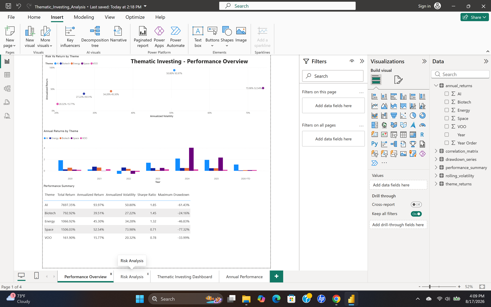
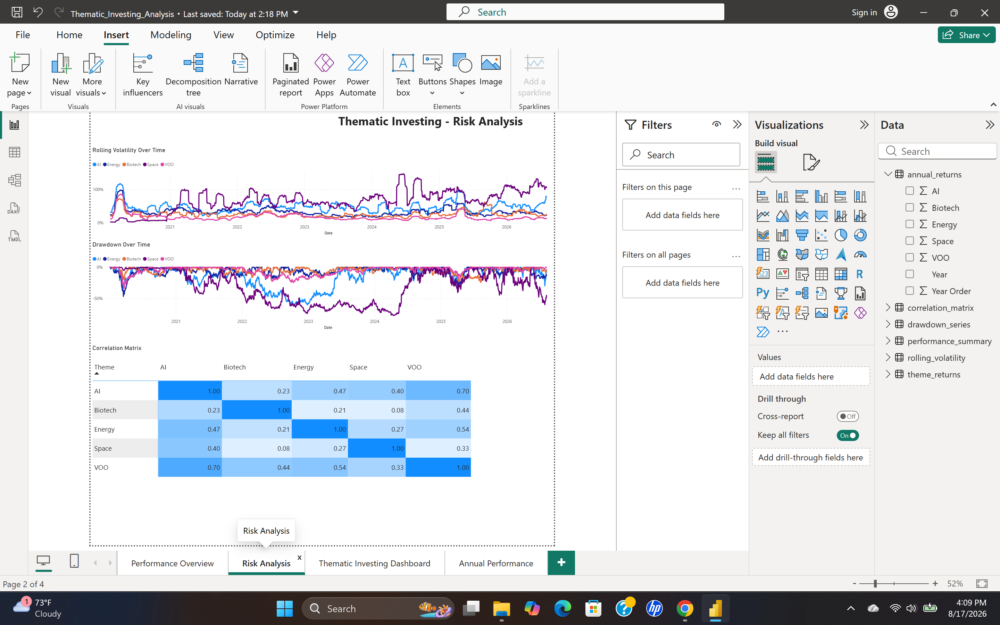
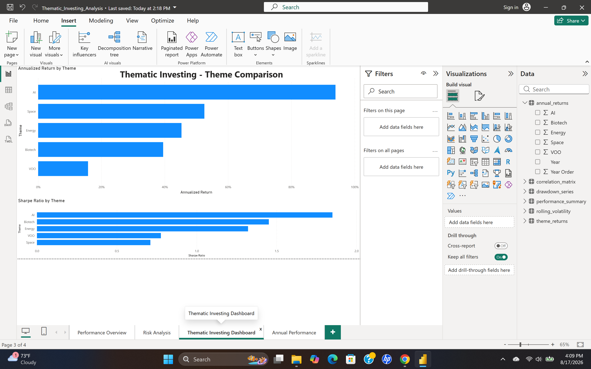
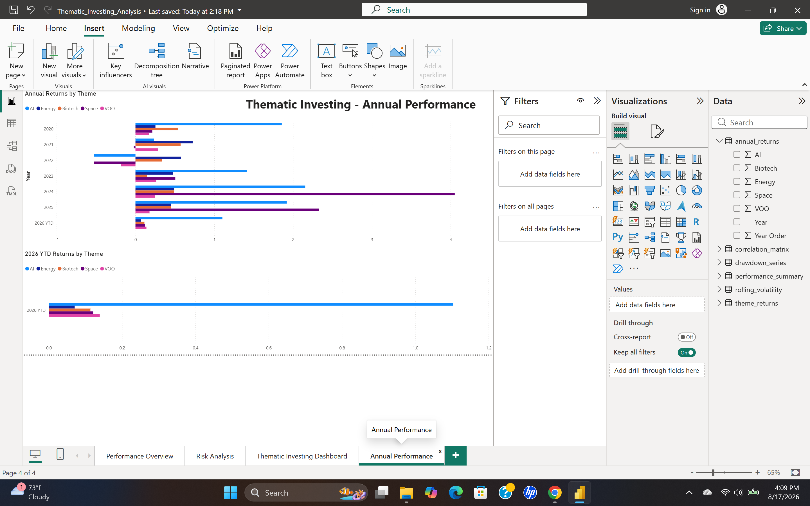

# Thematic Investment Analysis

An end-to-end investment analytics project using **Python, SQL, and Power BI** to evaluate the historical performance and risk characteristics of selected equities across four investment themes: **AI, Energy & Infrastructure, Biotech, and Space**, with the **Vanguard S&P 500 ETF (VOO)** serving as the market benchmark.

## Project Overview

This independent project was developed to examine the relationship between return and risk across several long-term investment themes while applying an integrated analytics workflow.

Historical market data is processed in Python to calculate theme-level performance and risk metrics. The resulting datasets are stored and queried using SQL and presented through a four-page Power BI dashboard designed to make comparisons across themes and against the broader market benchmark.

The analysis focuses on several questions:

- How have the selected investment themes performed relative to VOO?
- How much additional volatility and drawdown risk accompanied those returns?
- How do the themes compare on a risk-adjusted basis?
- How have performance and risk changed through different market periods?
- How sensitive are the results to differences in constituent trading histories?

## Investment Universe

| Theme | Constituents |
| --- | --- |
| **AI** | NVIDIA (NVDA), Palantir (PLTR), SanDisk (SNDK), Coherent (COHR) |
| **Energy & Infrastructure** | Cheniere Energy (LNG), Constellation Energy (CEG), Cameco (CCJ) |
| **Biotech** | Eli Lilly (LLY), United Therapeutics (UTHR) |
| **Space** | Rocket Lab (RKLB), AST SpaceMobile (ASTS) |
| **Benchmark** | Vanguard S&P 500 ETF (VOO) |

## Tools & Technologies

- **Python:** market-data retrieval, data cleaning, return calculations, risk analysis, and CSV export
- **pandas / NumPy:** data transformation and quantitative calculations
- **Matplotlib:** analytical visualizations
- **SQL / SQLite:** structured storage and querying of analytical outputs
- **DBeaver:** database management and SQL development
- **Power BI:** interactive dashboard development and presentation
- **Git / GitHub:** version control and project documentation

## Methodology

Historical price data for each constituent was retrieved and processed in Python. Daily returns were calculated at the security level and aggregated into equal-weighted thematic portfolios.

The analysis evaluates each theme using several performance and risk measures:

- **Total Return:** cumulative performance over the available analysis period
- **Annualized Return:** compounded return expressed on an annual basis
- **Annualized Volatility:** annualized standard deviation of daily returns
- **Sharpe Ratio:** risk-adjusted return relative to volatility
- **Maximum Drawdown:** largest peak-to-trough decline during the analysis period
- **Correlation:** relationship between theme returns and the broader market benchmark

Because several constituents began trading after the start of the analysis period, results were calculated using available trading histories. This limitation is considered when comparing cumulative and annualized performance across themes.

VOO is used as the benchmark to provide a broad U.S. equity-market comparison.

## Data Pipeline

The project follows an end-to-end analytical workflow:

1. **Market Data Retrieval** — Historical equity price data is retrieved for each constituent and the VOO benchmark.
2. **Python Processing** — Data is cleaned and transformed into daily returns, thematic portfolio returns, and risk metrics.
3. **CSV Export** — Analytical datasets are exported for validation and downstream use.
4. **SQLite Database** — Processed outputs are stored in a relational SQLite database.
5. **SQL Analysis** — SQL queries are used to inspect, aggregate, and validate performance and risk results.
6. **Power BI Visualization** — Final datasets are incorporated into a four-page dashboard for comparative analysis.
7. **Git / GitHub** — Project files, code, analytical outputs, and documentation are maintained under version control.

## Power BI Dashboard

The final Power BI report consists of four analytical views covering performance, risk, risk-adjusted returns, and annual performance.

### Performance Overview



### Risk Analysis



### Theme Comparison



### Annual Performance



## Key Findings

- **AI produced the strongest risk-adjusted performance** among the themes analyzed, generating the highest annualized return and Sharpe ratio despite elevated volatility.
- **Space generated strong historical returns but carried substantially greater risk**, including the highest annualized volatility and largest maximum drawdown among the themes.
- **Energy & Infrastructure and Biotech offered more moderate risk profiles** while still outperforming the VOO benchmark on an annualized-return basis over their respective available periods.
- **The thematic portfolios behaved differently across market environments**, with annual returns showing substantial variation from year to year.
- **Correlation with VOO varied considerably across themes**, suggesting that some thematic exposures provided greater diversification from the broader U.S. equity market than others.
- The results demonstrate the importance of evaluating **risk-adjusted performance rather than returns alone**, particularly when comparing high-growth investment themes.

## Limitations

- Constituents have different trading histories, meaning not all securities were available throughout the full analysis period.
- Theme-level portfolios are equal-weighted and represent a selected group of securities rather than comprehensive sector or thematic indexes.
- Historical performance does not indicate future results, and the analysis does not incorporate forecasts or expected returns.
- Transaction costs, taxes, portfolio rebalancing costs, and other implementation considerations are not included.
- Results are dependent on the selected constituents, benchmark, analysis period, and methodology.


## Repository Structure

```text
Thematic_Investing_Analysis/
├── Data/       # Analytical datasets and exported results
├── Images/     # Power BI dashboard screenshots
├── PowerBI/    # Power BI project file
├── Python/     # Python analysis workflow
├── SQL/        # SQLite database and SQL analysis script
└── README.md   # Project documentation
```

## About Me

I'm an MBA candidate concentrating in Finance with an interest in investment analysis, asset management, and data-driven financial decision-making. I developed this project independently to apply Python, SQL, Power BI, and financial analysis concepts in an end-to-end investment research workflow.

This project is part of my continuing development in financial analytics and quantitative investment research.
